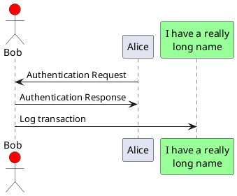

# MyTests

## Sequence diagram

```sequence
Alice->Bob: Hello Bob, how are you?
Note right of Bob: Bob thinks
Bob-->Alice: I am good thanks!
```


custom_mark10 digraph G { aize ="4,4"; main [shape=box]; main->parse [weight=8]; parse->execute; main->init [style=dotted]; main->cleanup; execute->{make_string; printf}; init->make_string; edge [color=red]; main->printf [style=bold,label="100 times"]; make_string [label="make a string"]; node [shape=box,style=filled,color=".7 .3 1.0"]; execute->compare; } custom_mark10


 parse -> execute;
   main -> init;
   main -> cleanup;
   execute -> make_string;
   execute -> printf
   init -> make_string;
   main -> printf;
   execute -> compare;
 }
'/>

 A: DoWork;
activate A;

A -> B: Create Request;
activate B;

B -> C: DoWork;
activate C;

C --> B: WorkDone;
destroy C;

B --> A: Request Created;
deactivate B;

A --> User: Done;
deactivate A;

@enduml
'>

]<>-orders*>[Order], [Order]++-0..*>[LineItem], [Order]-[note:Aggregate root{bg:wheat}])



